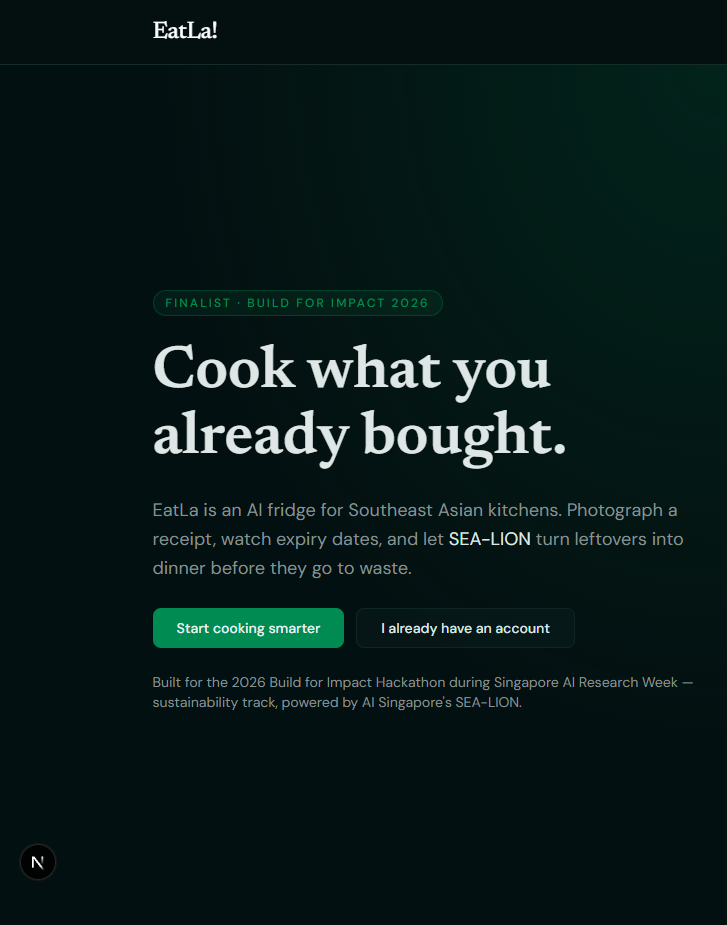
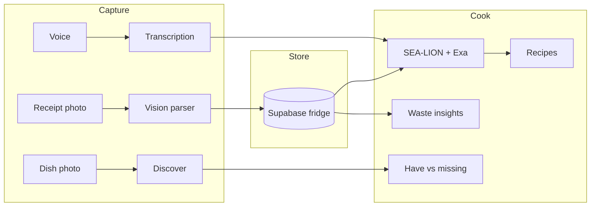

# EatLa

**Cook what you already bought.**

AI fridge companion for Southeast Asian kitchens. Photograph a grocery receipt, track expiry dates, and let [SEA-LION](https://aisingapore.org/aiproducts/sea-lion/) turn leftovers into dinner.

> **Finalist · [2026 Build for Impact Hackathon](https://www.sginnovate.com/event/2026-build-impact-hackathon)**  
> Hosted by Build Learning during the 40th AAAI Conference and Singapore AI Research Week. Challenge: build a real-world use for SEA-LION in charity, sustainability, or wellness. EatLa took the sustainability track.

[](https://nextjs.org)
[](https://www.typescriptlang.org)
[](https://supabase.com)
[](https://aisingapore.org/aiproducts/sea-lion/)



## Why it exists

Household food waste is usually a purchasing problem, not a cooking one. People buy a bundle of kangkong, cook it once, and throw the rest. Recipe apps assume a full pantry. Shopping lists assume you will use everything.

EatLa closes the loop:

**buy → track → cook → notice waste → buy differently**

It is built for the way Southeast Asian households actually cook: wet-market receipts, fish sauce already in the cupboard, and dishes that do not show up in generic Western meal planners.

## What it does

| Surface | What you get |
| --- | --- |
| **Upload** | Photograph an NTUC, Giant, or wet-market receipt. AI extracts food items and skips household junk. |
| **Fridge** | A visual fridge with quantities, expiry dates, and pantry staples such as soy sauce and belacan. |
| **Recipes** | SEA-LION writes detailed recipes from what you have — or the two extras worth buying. Optional Exa search grounds the model in real recipes. |
| **Discover** | Photograph a dish. EatLa names it, lists ingredients, and shows what you already own. |
| **Converse** | Speak what you feel like eating. Audio is transcribed, then turned into recipes. |
| **Insights** | After a few weeks, waste patterns become shopping advice: buy half a bundle, skip this week, try the frozen version. |

SEA-LION is the default chef. OpenAI and Gemini cover receipt parsing and food photography. If Cloudflare Workers AI is unavailable, recipe generation falls back to GPT.

## Architecture



**App:** Next.js 16, React 19, TypeScript, Tailwind CSS 4  
**Auth and data:** Supabase (email auth, row-level security, Postgres)  
**Recipes:** AI Singapore SEA-LION v4 on Cloudflare Workers AI, with Exa for search grounding  
**Vision:** OpenAI for receipts, Gemini for food images, optional [Qwen-SEA-LION-v4 VL](https://huggingface.co/aisingapore/Qwen-SEA-LION-v4-8B-VL) worker in `reverseImage/`  
**Insights:** Pattern analysis over waste events, then short shopping recommendations

## Getting started

### 1. Install

```bash
npm install
```

### 2. Environment

```bash
cp .env.example .env
```

Fill in:

| Variable | Used for |
| --- | --- |
| `NEXT_PUBLIC_SUPABASE_URL` | Supabase project URL |
| `NEXT_PUBLIC_SUPABASE_PUBLISHABLE_KEY` | Browser and server auth |
| `SUPABASE_SECRET_KEY` | Server-side privileged reads |
| `OPENAI_API_KEY` | Receipt parsing and fallback recipes |
| `GEMINI_API_KEY` | Ingredient and dish images |
| `EXA_API_KEY` | Recipe search grounding |
| `CLOUDFLARE_ACCOUNT_ID` | SEA-LION via Workers AI (optional) |
| `CLOUDFLARE_API_TOKEN` | SEA-LION via Workers AI (optional) |

Without Cloudflare credentials the app still runs. Recipe generation falls back to OpenAI.

### 3. Database

In the Supabase SQL editor, run:

1. [`supabase/schema.sql`](supabase/schema.sql) — receipts, ingredients, pantry staples, RLS
2. [`supabase/waste-tracking-migration.sql`](supabase/waste-tracking-migration.sql) — waste events and insights

### 4. Run

```bash
npm run dev
```

Open [http://localhost:3000](http://localhost:3000). The public landing page is at `/`. Sign in to reach the fridge.

## Project layout

```
src/app/(auth)       Login and signup
src/app/(main)       Fridge, upload, recipes, discover, insights
src/app/api          Receipt, recipe, insight, and transcription routes
src/lib/ai           Prompts, model IDs, SEA-LION + OpenAI clients
src/lib/supabase     Browser, server, and middleware clients
supabase/            Schema and waste-tracking migration
reverseImage/        Optional RunPod worker for SEA-LION vision
```

More detail on the waste loop lives in [`WASTE_INSIGHTS_FEATURE.md`](WASTE_INSIGHTS_FEATURE.md).

## Hackathon

EatLa was built in 48 hours for the **2026 Build for Impact Hackathon** (24–25 January, 32 Carpenter Street, Singapore) and named a **finalist**.

The brief from [SGInnovate / Build Learning](https://www.sginnovate.com/event/2026-build-impact-hackathon): apply design thinking to charity, sustainability, or wellness, and hero SEA-LION — a large language model trained for Southeast Asian languages and context by AI Singapore.

This repo is that prototype: a sustainability product that only makes sense if the model already understands *kangkong*, *belacan*, and a weeknight stir-fry.

## Team

Built by [Jovan Tan](https://github.com/jovantan88), Glenn, and [Kris](https://github.com/futonkris).

## License

MIT. See [LICENSE](LICENSE).
